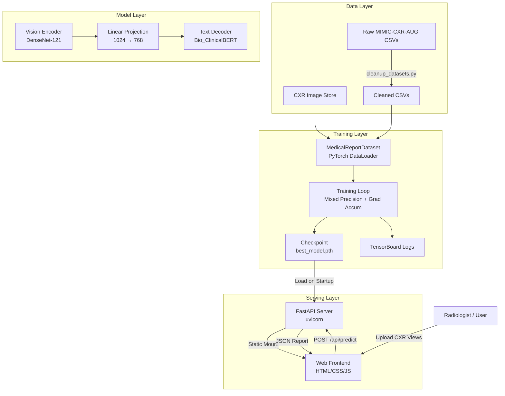
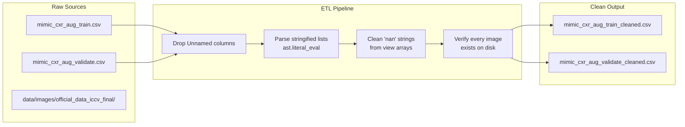
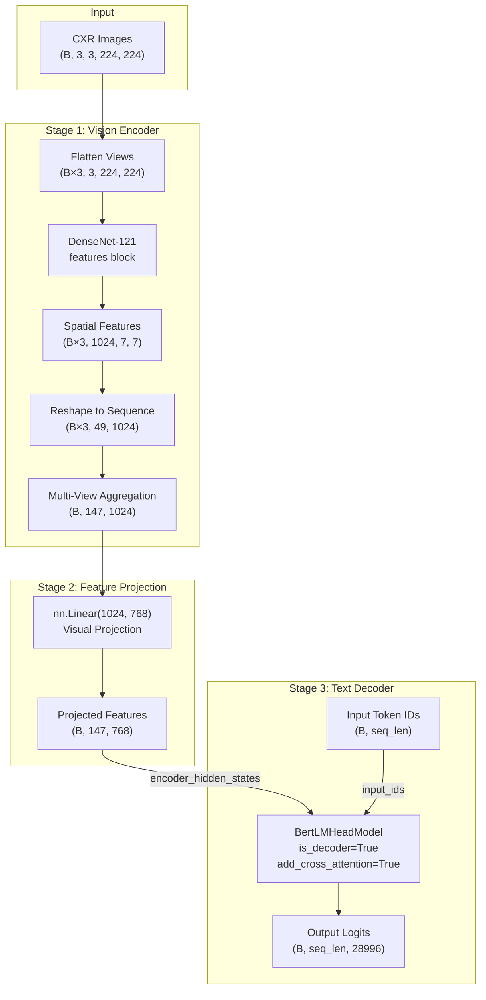
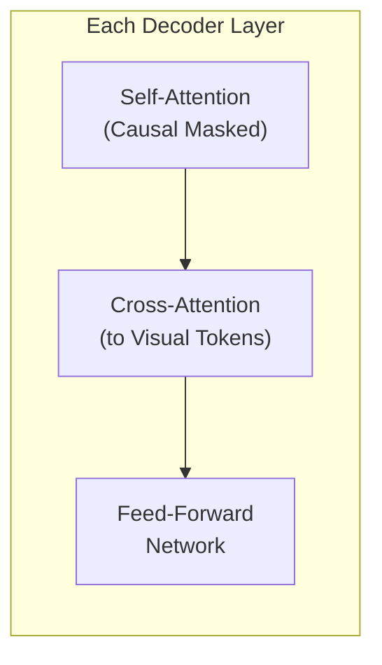
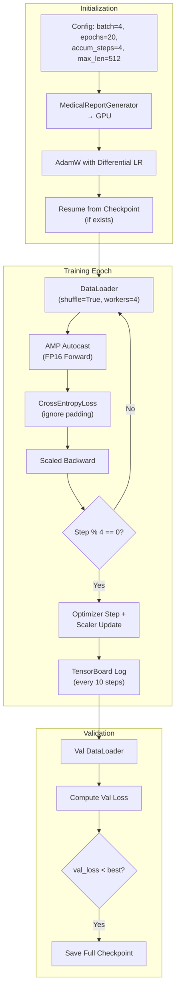
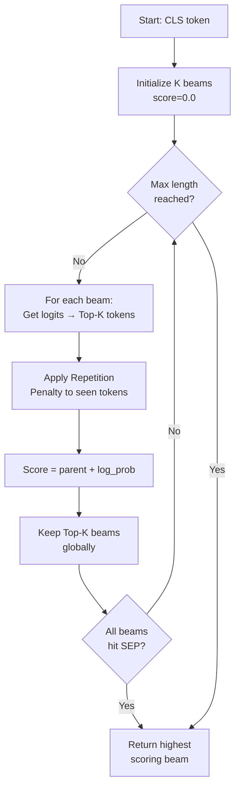
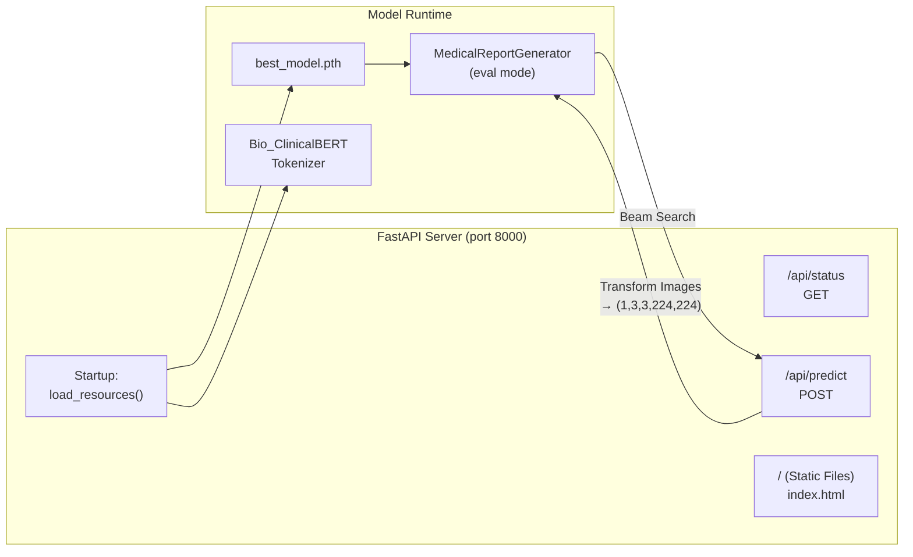
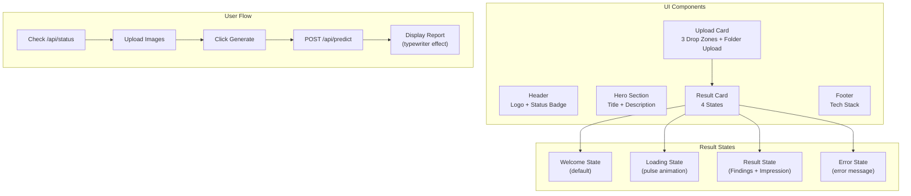
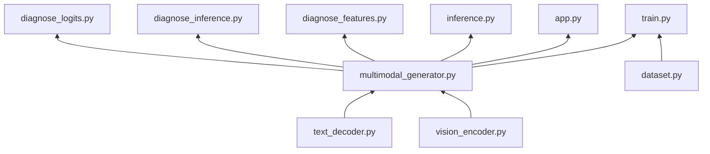

# 🏥 Multimodal Medical Diagnosis — System Architecture

> **Document Version**: 1.0  
> **Last Updated**: April 24, 2026  
> **Scope**: End-to-end architecture covering data pipeline, model internals, training loop, inference engine, API server, and web frontend.

---

## Table of Contents

1. [High-Level System Overview](#1-high-level-system-overview)
2. [Data Pipeline Architecture](#2-data-pipeline-architecture)
3. [Model Architecture — Deep Dive](#3-model-architecture--deep-dive)
4. [Training Pipeline Architecture](#4-training-pipeline-architecture)
5. [Inference & Generation Engine](#5-inference--generation-engine)
6. [Serving Architecture (API + Frontend)](#6-serving-architecture-api--frontend)
7. [Directory & Module Map](#7-directory--module-map)
8. [Tensor Flow & Shape Analysis](#8-tensor-flow--shape-analysis)
9. [Design Decisions & Trade-off Review](#9-design-decisions--trade-off-review)
10. [Security & Reliability Considerations](#10-security--reliability-considerations)

---

## 1. High-Level System Overview

The system is an **image-to-text medical AI pipeline** that ingests multi-view Chest X-Ray (CXR) images and produces structured radiology reports. It is a full-stack application spanning from raw data processing to a production-ready web dashboard.



### System Summary

| Aspect | Technology |
|:---|:---|
| **Vision Backbone** | DenseNet-121 (ImageNet pretrained) |
| **Language Backbone** | Bio_ClinicalBERT (MIMIC-III pretrained) |
| **Fusion Strategy** | Cross-Attention via projected visual tokens |
| **Generation** | Beam Search with Repetition Penalty |
| **Backend** | FastAPI + Uvicorn |
| **Frontend** | Vanilla HTML/CSS/JS (Glassmorphism UI) |
| **Training** | PyTorch AMP + Gradient Accumulation |
| **Monitoring** | TensorBoard |

---

## 2. Data Pipeline Architecture

### 2.1 Raw Data Ingestion

The project consumes the **MIMIC-CXR-AUG** dataset, a structured version of the MIMIC-CXR database augmented for multimodal training.



### 2.2 CSV Schema

| Column | Type | Description |
|:---|:---|:---|
| `subject_id` | int | Unique patient identifier |
| `image` | List[str] | Relative paths to all CXR images for the study |
| `view` | List[str] | Anatomical view labels (`'PA'`, `'AP'`, `'LATERAL'`) |
| `AP` / `PA` / `Lateral` | List[str] | Pre-filtered view-specific filenames |
| `text` | List[str] | Original radiology reports (Findings & Impression) |
| `text_augment` | List[str] | Synthetically augmented report variants |

### 2.3 Dataset Class (`MedicalReportDataset`)

The PyTorch `Dataset` handles the complex mapping from tabular CSV + image files to batched tensors.

**Key Responsibilities:**
1. **Multi-view loading**: Reads up to 3 images per study (AP, PA, Lateral)
2. **Zero-padding**: Missing views are filled with `torch.zeros(3, 224, 224)` to maintain batch shape consistency
3. **Image transforms**: Resize → ToTensor → ImageNet Normalize
4. **Tokenization**: Reports tokenized with Bio_ClinicalBERT tokenizer, padded/truncated to `max_length`

**Output per sample:**
```
{
    'image':          Tensor(3, 3, 224, 224),   # NumViews × C × H × W
    'input_ids':      Tensor(max_length),        # Token IDs
    'attention_mask':  Tensor(max_length)          # Padding mask
}
```

---

## 3. Model Architecture — Deep Dive

The model (`MedicalReportGenerator`) is an **encoder-decoder** architecture with three distinct stages.

### 3.1 Full Model Diagram



### 3.2 Vision Encoder — `CXRVisionEncoder`

**File**: `scripts/models/vision_encoder.py`

| Property | Detail |
|:---|:---|
| **Backbone** | `torchvision.models.densenet121` |
| **Pretrained Weights** | ImageNet (DenseNet121_Weights.DEFAULT) |
| **Layers Used** | `densenet.features` only (classifier head removed) |
| **Output Channels** | 1024 |
| **Spatial Grid** | 7×7 (for 224×224 input) → 49 patches |
| **Freezing** | Optional via `freeze_weights` parameter |

**How it works:**

DenseNet-121 processes each image independently. The final feature map is a 7×7 spatial grid with 1024 channels. Instead of global average pooling (which would discard spatial information), the grid is **flattened into a sequence of 49 visual tokens**, each carrying 1024-dimensional features. This preserves spatial locality for the decoder's cross-attention.

```
Input:  (B, 3, 224, 224)  →  DenseNet Features  →  (B, 1024, 7, 7)
                                                  →  reshape  →  (B, 49, 1024)
```

### 3.3 Multi-View Aggregation

**File**: `scripts/models/multimodal_generator.py` → `encode_images()`

This is the critical fusion step. Instead of processing views independently and averaging, the system **concatenates spatial tokens** from all views:

```python
# Input: (B, NumViews=3, C=3, H=224, W=224)
flat_images = images.view(-1, C, H, W)           # (B×3, 3, 224, 224)
flat_features = vision_encoder(flat_images)        # (B×3, 49, 1024)
view_features = flat_features.view(B, 3, 49, 1024) # (B, 3, 49, 1024)
aggregated = view_features.reshape(B, 147, 1024)   # (B, 147, 1024)
```

**Result**: The decoder receives **147 visual tokens** (3 views × 49 patches each). During cross-attention, each generated word can attend to any spatial region across **all** views simultaneously.

### 3.4 Visual Projection

A single `nn.Linear(1024, 768)` layer maps DenseNet's 1024-dim features to Bio_ClinicalBERT's expected 768-dim hidden size. This is necessary because the cross-attention mechanism in BERT requires matching dimensions.

### 3.5 Text Decoder — `RadiologyReportDecoder`

**File**: `scripts/models/text_decoder.py`

| Property | Detail |
|:---|:---|
| **Base Model** | `emilyalsentzer/Bio_ClinicalBERT` |
| **HF Class** | `BertLMHeadModel` |
| **Config Mods** | `is_decoder=True`, `add_cross_attention=True`, `tie_word_embeddings=False` |
| **Vocab Size** | 28,996 tokens |
| **Hidden Size** | 768 |
| **Num Layers** | 12 Transformer layers |
| **Max Length** | Configurable (default 128, training uses 512) |

**How it works:**

Bio_ClinicalBERT is normally a bidirectional encoder. By setting `is_decoder=True`, it applies **causal masking** (each token can only attend to previous tokens). With `add_cross_attention=True`, each Transformer layer gains an additional **cross-attention sub-layer** that attends to the visual features provided as `encoder_hidden_states`.



**Why Bio_ClinicalBERT?** It is pre-trained on ~2M clinical notes from the MIMIC-III database, giving it strong prior knowledge of medical terminology, abbreviations, and report structure.

---

## 4. Training Pipeline Architecture

**File**: `scripts/training/train.py`

### 4.1 Training Loop Diagram



### 4.2 Key Training Features

#### Differential Learning Rates
The model uses **two parameter groups** with different learning rates:

| Parameter Group | LR | Rationale |
|:---|:---|:---|
| Pretrained (DenseNet + BERT core) | `1e-5` | Preserve pre-trained knowledge |
| New (cross-attention + projection) | `4e-5` | Faster adaptation for new layers |

#### Gradient Accumulation
With `accumulation_steps=4` and `batch_size=4`, the effective batch size is **16**. This allows training with multi-view inputs on limited VRAM.

#### Mixed Precision Training
Uses `torch.amp.autocast('cuda')` + `GradScaler` for FP16 forward/backward passes, reducing memory usage and speeding up training.

#### Full State Checkpointing
The checkpoint saves **all state** needed for seamless resumption:
```python
{
    'epoch': epoch,
    'model_state_dict': model.state_dict(),
    'optimizer_state_dict': optimizer.state_dict(),
    'best_val_loss': best_val_loss
}
```

#### Teacher Forcing
During training, the model receives the **ground truth token sequence** shifted by one position:
- **Input**: `tokens[:, :-1]` (all tokens except last)
- **Target**: `tokens[:, 1:]` (all tokens except first)

This is standard autoregressive training with `CrossEntropyLoss`.

---

## 5. Inference & Generation Engine

**File**: `scripts/models/multimodal_generator.py` → `generate()`

### 5.1 Beam Search Algorithm



### 5.2 Generation Parameters

| Parameter | Default | Description |
|:---|:---|:---|
| `k` (beam width) | 5 | Number of parallel hypotheses |
| `max_length` | 128 | Maximum tokens to generate |
| `repetition_penalty` | 1.5 (train) / 2.0 (serve) | Penalty for repeating tokens |

### 5.3 Repetition Penalty Mechanism

To prevent degenerate outputs like `": : : : :"`, the generation applies a multiplicative penalty to already-generated tokens:

```python
for token_id in generated_tokens:
    if logits[token_id] > 0:
        logits[token_id] /= repetition_penalty   # reduce positive logits
    else:
        logits[token_id] *= repetition_penalty    # push negative logits further down
```

---

## 6. Serving Architecture (API + Frontend)

### 6.1 Backend — FastAPI

**File**: `scripts/app.py`



#### API Endpoints

| Endpoint | Method | Purpose |
|:---|:---|:---|
| `/api/status` | GET | Health check — reports device, checkpoint status |
| `/api/predict` | POST | Accepts up to 3 image uploads (ap_view, pa_view, lateral_view), returns generated report |
| `/` | GET | Serves the static frontend (index.html) |

#### Image Processing Pipeline (Server-Side)
```
Upload → PIL.Image.open() → RGB convert → Resize(224×224) → ToTensor → ImageNet Normalize
→ Stack 3 views → Unsqueeze batch dim → (1, 3, 3, 224, 224) → model.generate()
```

Missing views are filled with `torch.zeros(3, 224, 224)`.

### 6.2 Frontend — Web Dashboard

**Files**: `scripts/static/index.html`, `script.js`, `style.css`



#### Frontend Features
- **Glassmorphism UI**: Frosted-glass card effects with `backdrop-filter: blur(12px)`
- **Animated Background**: Three floating gradient blobs with CSS keyframe animations
- **Smart Folder Upload**: Auto-maps files named `ap.jpg`/`pa.jpg`/`lateral.jpg` to correct slots
- **Typewriter Effect**: Generated findings are displayed character-by-character (15ms/char)
- **Responsive Grid**: Two-column layout collapses to single column at 1024px

---

## 7. Directory & Module Map

```
multimodal_medical_diagnosis/
├── data/
│   ├── raw/                          # Original MIMIC-CXR-AUG CSVs
│   ├── processed/                    # Cleaned CSVs (output of ETL)
│   ├── images/official_data_iccv_final/  # CXR image store
│   └── infer_ease/                   # Pre-organized inference samples
├── models/
│   ├── checkpoints/best_model.pth    # Trained model weights
│   └── logs/                         # TensorBoard event files
├── scripts/
│   ├── models/                       # Neural network definitions
│   │   ├── vision_encoder.py         # DenseNet-121 feature extractor
│   │   ├── text_decoder.py           # Bio_ClinicalBERT decoder
│   │   └── multimodal_generator.py   # Fusion model + beam search
│   ├── data_prep/                    # Data ETL pipeline
│   │   ├── dataset.py                # PyTorch Dataset class
│   │   ├── cleanup_datasets.py       # CSV cleaning & image verification
│   │   ├── analyze_datasets.py       # Data quality auditing
│   │   └── debug_missing.py          # Missing image debugger
│   ├── training/
│   │   ├── train.py                  # Full training loop
│   │   └── inference.py              # Standalone inference test
│   ├── static/                       # Web frontend
│   │   ├── index.html                # Dashboard HTML
│   │   ├── script.js                 # Client-side logic
│   │   └── style.css                 # Glassmorphism styles
│   ├── app.py                        # FastAPI server
│   ├── setup_hf.py                   # Pre-cache HuggingFace models
│   ├── prepare_infer_ease.py         # Prepare inference test samples
│   ├── analyze_logs.py               # TensorBoard log analyzer
│   ├── diagnose_features.py          # Feature variation diagnostics
│   ├── diagnose_inference.py         # Inference difference test
│   └── diagnose_logits.py            # Logit variation diagnostics
└── tasks/                            # Project management
```

### Module Dependency Graph



---

## 8. Tensor Flow & Shape Analysis

This section traces the exact tensor shapes through every stage of the pipeline.

### 8.1 Forward Pass (Training)

```
Step                          Shape                    Notes
─────────────────────────────────────────────────────────────────
Input Images                  (B, 3, 3, 224, 224)      B=batch, 3 views, RGB, 224×224
Flatten Views                 (B×3, 3, 224, 224)       Treat each view independently
DenseNet Features             (B×3, 1024, 7, 7)        1024 channels, 7×7 spatial
Reshape to Sequence           (B×3, 49, 1024)          49 patches per view
Reshape by Batch              (B, 3, 49, 1024)         Group back by batch
Concatenate Views             (B, 147, 1024)           3×49 = 147 visual tokens
Visual Projection             (B, 147, 768)            Match BERT hidden size
Input IDs (shifted)           (B, seq_len-1)           Teacher-forced tokens
BERT Decoder Output           (B, seq_len-1, 28996)    Logits over vocabulary
Targets (shifted)             (B, seq_len-1)           Ground truth next tokens
CrossEntropy Loss             scalar                   Ignoring pad_token_id
```

### 8.2 Inference Pass (Beam Search)

```
Step                          Shape                    Notes
─────────────────────────────────────────────────────────────────
Input Images                  (1, 3, 3, 224, 224)      Single study
Visual Encoding               (1, 147, 768)            Same as training
Initial Beam                  (1, 1)                   Just [CLS] token
Per Step: Decoder             (1, t, 28996)            t = current length
Next Token Logits             (28996,)                 Last position logits
Apply Rep. Penalty            (28996,)                 Penalize seen tokens
Top-K Selection               K candidates             Expand each beam
Prune to K Beams              K beams kept              Best scores survive
Final Output                  string                   Decoded best beam
```

---

## 9. Design Decisions & Trade-off Review

### 9.1 Architecture Choices

| Decision | Choice Made | Alternatives | Rationale |
|:---|:---|:---|:---|
| **Vision backbone** | DenseNet-121 | ResNet-50, ViT, EfficientNet | DenseNet's dense connections are well-suited for medical imaging; feature reuse preserves fine details |
| **Spatial tokens vs. global pool** | Spatial (49 tokens/view) | Global average pooling | Spatial tokens let the decoder attend to specific image regions — critical for localized findings |
| **Multi-view fusion** | Concatenation | Average pooling, attention-based | Concatenation preserves all spatial info; lets cross-attention learn view relevance implicitly |
| **Language model** | Bio_ClinicalBERT | GPT-2, T5, BioGPT | Pre-trained on MIMIC-III clinical notes — strong domain match for radiology language |
| **BERT as decoder** | Causal mask + cross-attn | Native decoder model | Leverages clinical pre-training; native decoders lack medical domain knowledge |
| **Generation strategy** | Beam Search (k=5) | Greedy, Nucleus Sampling | Beam search produces more coherent reports; repetition penalty prevents loops |
| **Projection layer** | Single linear layer | MLP, attention adapter | Simplicity; a linear projection is sufficient for dimension matching |

### 9.2 Training Strategy Review

| Decision | Choice | Rationale |
|:---|:---|:---|
| **Differential LR** | 1e-5 pretrained / 4e-5 new | Prevents catastrophic forgetting of ImageNet + clinical knowledge |
| **Gradient accumulation** | 4 steps (eff. batch=16) | Multi-view inputs are VRAM-intensive; accumulation simulates larger batches |
| **Mixed precision** | FP16 via AMP | ~2× speedup, ~40% memory reduction with minimal accuracy loss |
| **Checkpointing** | Full state (model + optimizer + epoch + best_loss) | Enables seamless training resumption without loss spikes |
| **Max sequence length** | 512 tokens | Radiology reports can be lengthy; 128 truncates important findings |

### 9.3 Strengths

1. **Multi-view awareness**: 147 visual tokens across 3 views gives the decoder comprehensive spatial context
2. **Domain-specific language**: Bio_ClinicalBERT's pre-training on clinical notes produces natural medical language
3. **Robust data pipeline**: Image existence verification prevents silent training errors from missing files
4. **Production-ready serving**: FastAPI + static frontend is deployable with a single command
5. **Diagnostic tooling**: Three separate diagnostic scripts help debug feature collapse, logit variation, and inference quality

### 9.4 Potential Improvements

| Area | Current Limitation | Possible Enhancement |
|:---|:---|:---|
| **View encoding** | All views share one DenseNet | View-specific encoders or view-type embeddings |
| **Zero-padding** | Missing views → zero tensors | Learned mask tokens or attention masking |
| **Projection** | Single linear layer | Multi-layer adapter with residual connections |
| **Generation** | Basic beam search | Nucleus sampling, length normalization, n-gram blocking |
| **Evaluation** | Only val loss | BLEU, ROUGE, CheXpert F1, clinical accuracy metrics |
| **Attention vis** | Not implemented | Grad-CAM heatmaps on CXR regions for explainability |

---

## 10. Security & Reliability Considerations

### 10.1 Model Loading Safety
- Checkpoint loading uses `map_location=device` to prevent CUDA↔CPU mismatches
- Legacy checkpoint format (raw state_dict) is gracefully handled alongside full-state format
- Failed optimizer restoration falls back to fresh optimizer without crashing

### 10.2 API Robustness
- `/api/status` provides health checks before allowing inference
- Missing checkpoint → HTTP 503 with clear error message (not a crash)
- Image processing errors are caught with full traceback logging
- CORS middleware enabled for flexible frontend deployment

### 10.3 Data Integrity
- `cleanup_datasets.py` verifies every image path on disk before including rows
- Dataset class wraps individual image loads in try/except with zero-tensor fallback
- `analyze_datasets.py` provides pre-training data quality auditing

### 10.4 Known Environment Issues
- **OpenMP conflict**: `KMP_DUPLICATE_LIB_OK=TRUE` set at script top to prevent `libiomp5md.dll` crashes on Windows
- **HuggingFace symlinks**: Warning suppressed via `HF_HUB_DISABLE_SYMLINKS_WARNING=1`

---

> **End of Architecture Document**  
> For getting started instructions, see [README.md](file:///d:/projects/multimodal_medical_diagnosis/README.md).
