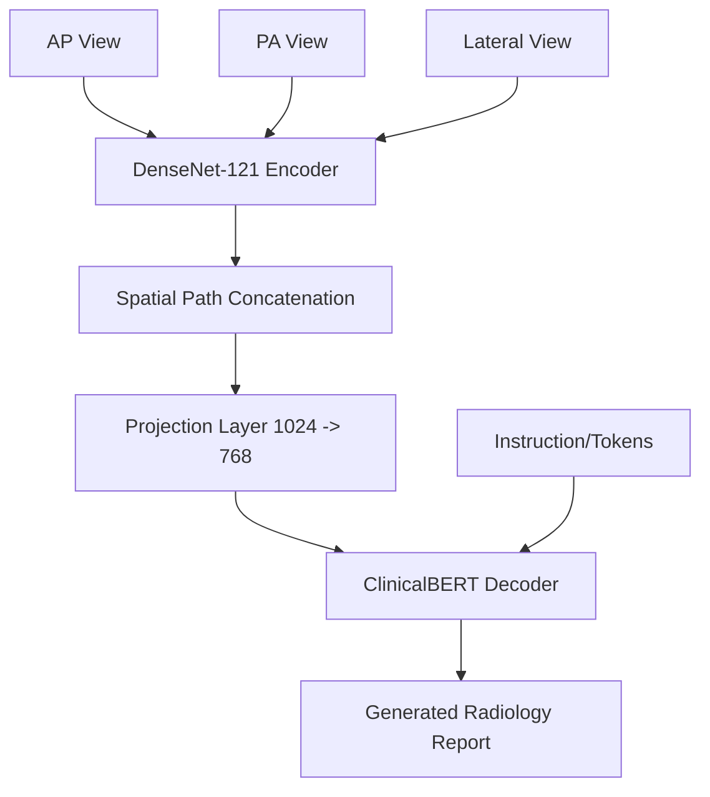

# Multimodal Medical Diagnosis: CXR Image-to-Text Generation

[](https://github.com/)
[](https://github.com/)
[](https://github.com/)

An advanced multimodal deep learning pipeline designed to automatically generate clinical radiology reports from Chest X-Ray (CXR) images. By leveraging state-of-the-art vision encoders and language decoders, the system interprets complex medical imagery and produces structured, professional-grade findings and impressions.

---

## 🏗️ System Architecture

The project implements a **Vision-Transformer** architecture specifically tuned for medical data. It treats multiple views of a patient's chest as a single coherent input sequence.

### Workflow Diagram



### Components Deep Dive

1.  **Vision Encoder (DenseNet-121)**: 
    - Loads ImageNet-pretrained weights and strips the final pooling/classification layers.
    - Extracts **7x7 spatial feature maps** (1024 dimensions per patch).
    - Treats the 49 patches as a "visual sequence" for the decoder to attend to.
2.  **Multi-View Aggregation**:
    - Processes up to 3 views (standard clinical practice: Frontal AP/PA and Lateral).
    - Concatenates the spatial patches from all views, providing the transformer with a total context of **147 visual tokens**.
3.  **Language Decoder (Bio_ClinicalBERT)**:
    - Pretrained on clinical notes from the MIMIC-III database.
    - Modified as a **Decoder-only Transformer** with cross-attention enabled.
    - Performs autoregressive generation using the visual features as the "Encoder Hidden States".

---

## 📊 Dataset: MIMIC-CXR-AUG

The project uses a structured version of the MIMIC-CXR dataset, augmented for multimodal tasks.

### Schema Definition

| Column | Description |
| :--- | :--- |
| `subject_id` | Unique patient identifier. |
| `image` | List of relative paths to all available CXR images for the study. |
| `view` | List of corresponding anatomical views (e.g., `'PA'`, `'LATERAL'`). |
| `AP` / `PA` / `Lateral` | Filename(s) specifically filtered for these key views. |
| `text` | The original professional radiology report (Findings & Impression). |
| `text_augment` | Synthetically augmented versions of the reports for robust training. |

### Preprocessing Pipeline
- **Cleaning**: Redundant index columns are stripped.
- **Filtering**: Rows referencing missing image files are automatically purged.
- **Standardization**: View names are cleaned and empty lists are handled.
- **Tokenization**: Reports are padded/truncated to a consistent length (default 512).

---

## 🛠️ Detailed Script Roles

### 1. Data Preparation (`scripts/data_prep/`)

- **[`cleanup_datasets.py`](file:///d:/projects/multimodal_medical_diagnosis/scripts/data_prep/cleanup_datasets.py)**: The primary ETL script. It evaluates stringified lists, verifies every image path on disk, and saves a high-integrity `_cleaned.csv`.
- **[`dataset.py`](file:///d:/projects/multimodal_medical_diagnosis/scripts/data_prep/dataset.py)**: Implements the `MedicalReportDataset`. It handles the complex logic of loading multiple images per study and padding missing views with zero-tensors to ensure batch consistency.
- **[`analyze_datasets.py`](file:///d:/projects/multimodal_medical_diagnosis/scripts/data_prep/analyze_datasets.py)**: A diagnostic tool to audit data quality before starting heavy training runs.

### 2. Model Core (`scripts/models/`)

- **[`multimodal_generator.py`](file:///d:/projects/multimodal_medical_diagnosis/scripts/models/multimodal_generator.py)**: The brain of the project. It fuses the `CXRVisionEncoder` and `RadiologyReportDecoder`. It also contains the **Beam Search** implementation for high-quality text generation.
- **[`vision_encoder.py`](file:///d:/projects/multimodal_medical_diagnosis/scripts/models/vision_encoder.py)**: Encapsulates the torchvision DenseNet backbone and the spatial flattening logic.
- **[`text_decoder.py`](file:///d:/projects/multimodal_medical_diagnosis/scripts/models/text_decoder.py)**: Customizes the Hugging Face BERT model to act as a cross-attentional decoder.

### 3. Execution (`scripts/training/`)

- **[`train.py`](file:///d:/projects/multimodal_medical_diagnosis/scripts/training/train.py)**: Handles the full training lifecycle including TensorBoard logging and periodic model checkpointing.
- **[`inference.py`](file:///d:/projects/multimodal_medical_diagnosis/scripts/training/inference.py)**: A lightweight script for testing the model on new images without needing the full training data.

---

## 🚀 Advanced Features

### 🔦 Beam Search Generation
Instead of greedy decoding (picking the single most likely word), the model implements **Beam Search** with a default beam width of 5. This explores multiple possible report structures simultaneously to find the most coherent overall sequence.

### 🧩 Multi-View Aggregation
Medical diagnosis often requires looking at a patient from multiple angles. Our model:
1. Encodes AP, PA, and Lateral views separately.
2. Concatenates their spatial descriptors.
3. Allows the Transformer to "look" across all angles while generating each word of the report.

---

## 🌐 Web Application (Full-Stack)

The project includes a premium, interactive web dashboard for real-time inference.

### Features
- **Modern Dashboard**: Glassmorphism UI with dark mode and animated gradients.
- **Multi-View Upload**: Drag-and-drop support for AP, PA, and Lateral views.
- **Real-time Status**: Automatic system health check for model checkpoint availability.
- **Typewriter Reporting**: Professional report generation with live text animation.

### Starting the App
1.  **Launch the Backend Server**:
    ```bash
    python scripts/app.py
    ```
2.  **Access the Dashboard**:
    Open your browser and navigate to `http://localhost:8000`.

> [!IMPORTANT]
> **Model Checkpoint Required**: The web app will strictly check for `models/checkpoints/best_model.pth` on startup. If missing, inference will be disabled to ensure diagnostic integrity.

---

## ⚙️ Technical Configuration

| Parameter | Value |
| :--- | :--- |
| **Vision Backbone** | DenseNet-121 (pretrained) |
| **Language Backbone** | Bio_ClinicalBERT |
| **Max Seq Length** | 512 tokens |
| **Batch Size** | 2 (Optimized for Multi-View VRAM) |
| **Learning Rate** | 5e-5 |
| **Optimizer** | AdamW |
| **Loss Function** | CrossEntropy (ignoring padding) |

---

## 🚀 Getting Started

1.  **Environment Setup**:
    ```bash
    pip install torch torchvision transformers tqdm pandas pillow tensorboard
    python scripts/setup_hf.py
    ```
2.  **Data Cleaning**:
    ```bash
    python scripts/data_prep/cleanup_datasets.py
    ```
3.  **Training**:
    ```bash
    python scripts/training/train.py
    ```
4.  **Monitoring**:
    ```bash
    tensorboard --logdir models/logs
    ```

---

## ⚠️ Troubleshooting

### OpenMP Runtime Error
If you encounter `OMP: Error #15: Initializing libiomp5md.dll, but found libiomp5md.dll already initialized.`, the project provides an automatic fix within `train.py`. Ensure these lines are at the very top:
```python
import os
os.environ["KMP_DUPLICATE_LIB_OK"] = "TRUE"
```

### Missing Images
Run `python scripts/data_prep/debug_missing.py` to check if your image directory structure matches the CSV entries.
